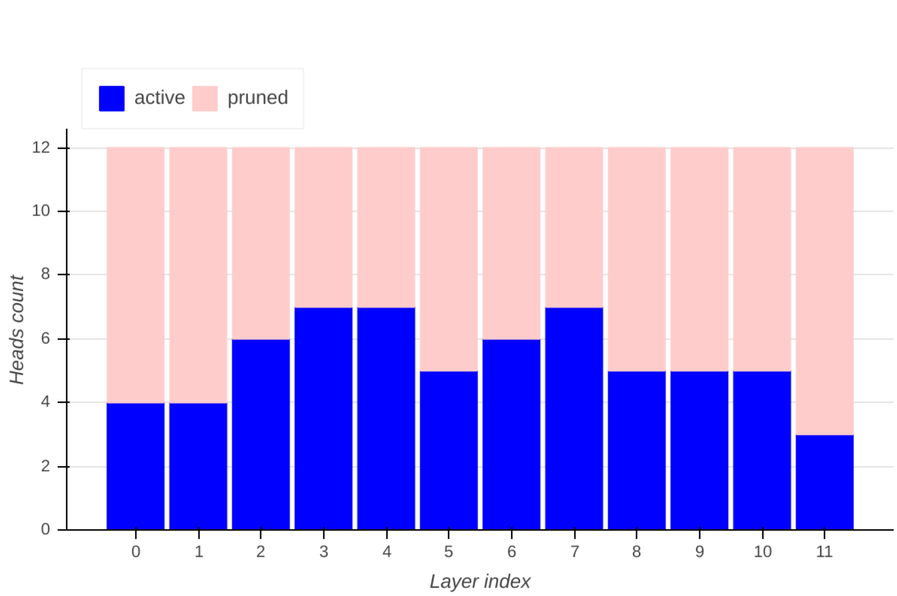
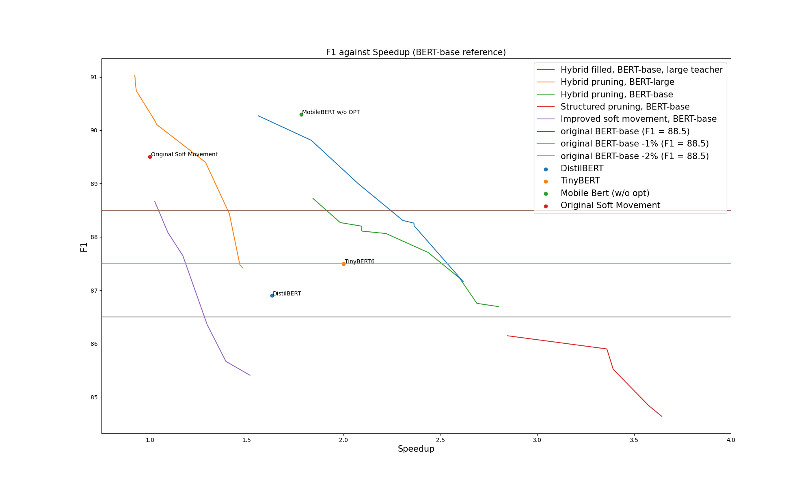
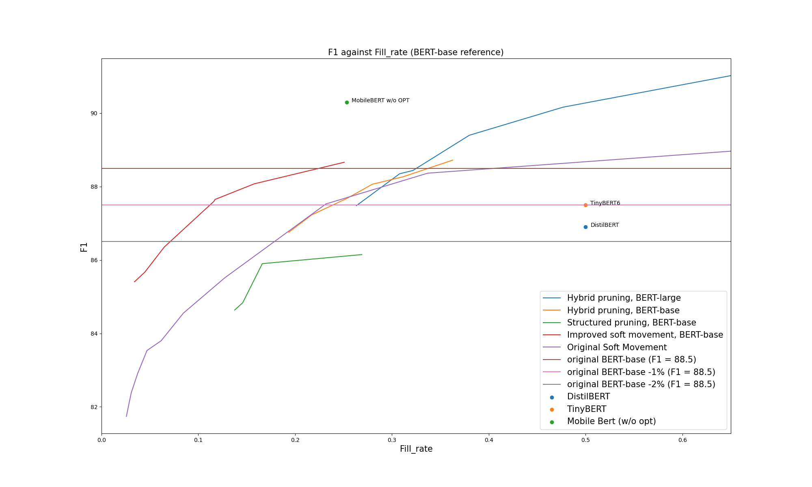

# Neural Networks Block Movement Pruning

An interactive version of this site is available [here](https://huggingface.github.io/nn_pruning/).

***[Movement](https://arxiv.org/abs/2005.07683) [pruning](https://github.com/huggingface/transformers/tree/master/examples/research_projects/movement-pruning)** has been proved as a **very efficient
method to prune networks in a unstructured manner**. High levels of sparsity can be reached with a minimal of accuracy loss. 
The resulting sparse networks can be **compressed heavily**,
saving a lot of permanent storage space on servers or devices, and bandwidth, an important advantage for edge devices.
**But efficient inference with unstructured sparsity is hard.**
Some degree of structure is necessary to use the intrinsic parallel nature of today hardware.
**Block Movement Pruning** work extends the original method and explore **semi-structured and structured variants** of Movement Pruning.
You can read more about block sparsity and why it matters for performance on these [blog](https://medium.com/huggingface/is-the-future-of-neural-networks-sparse-an-introduction-1-n-d03923ecbd70) [posts](https://medium.com/huggingface/sparse-neural-networks-2-n-gpu-performance-b8bc9ce950fc).*

# How to use
The documentation is [here](docs/HOWTO.md).

## Results

### Squad V1
The experiments were done first on SQuAD v1.

Two networks were tested: BERT-base, and BERT-large.

Very significant speedups were obtained with limited drop in accuracy.

Here is a selection of the networks that are obtained through the different variant method variants.

The original "large" and "base" finedtuned models were added in the table for comparison.

The "BERT version" column shows which base network was pruned.
The parameter count column is relative to linear layers, which contain most of the model parameters (with the embeddings being most of the remaining parameters).

**F1 difference, speedups and parameters counts are all relative to BERT-base to ease practical comparison.**
    
|                                              Model                                               |  Type   |   method    | Params  |   F1    | F1 diff | Speedup |
|--------------------------------------------------------------------------------------------------|---------|-------------|---------|---------|---------|---------|
|**[#1](https://huggingface.co/bert-large-uncased-whole-word-masking-finetuned-squad)**            |**large**|**-**        |**+166%**|**93.15**|**+4.65**|**0.35x**|
|#2                                                                                                |large    |hybrid-filled|-17%     |    91.03|+2.53    |0.92x    |
|#3                                                                                                |large    |hybrid-filled|-40%     |    90.16|+1.66    |1.03x    |
|#4                                                                                                |base     |hybrid-filled|-59%     |    88.72|+0.22    |1.84x    |
|**[#5](https://huggingface.co/csarron/bert-base-uncased-squad-v1)**                               |**base** |**-**        |**+0%**  |**88.5** |**+0.00**|**1.00x**|
|#6                                                                                                |base     |hybrid-filled|-65%     |    88.25|-0.25    |1.98x    |
|**[#7](https://huggingface.co/madlag/bert-base-uncased-squadv1-x2.44-f87.7-d26-hybrid-filled-v1)**|base     |hybrid-filled|-74%     |    87.71|-0.79    |2.44x    |
|#8                                                                                                |base     |hybrid-filled|-73%     |    87.23|-1.27    |2.60x    |
|#9                                                                                                |base     |hybrid-filled|-74%     |    86.69|-1.81    |2.80x    |
|#10                                                                                               |base     |struct       |-86%     |    85.52|-2.98    |3.64x    |

### Main takeaways
- network #2: pruned from BERT-large, it's significantly more accurate than BERT-base, but have a similar size and speed.
- network #3: pruned from BERT-large, it is finally 40% smaller but significantly better than a BERT-base, and still as fast.

That means that starting from a larger networks is beneficial on all metrics, even absolute size, something observed in the [Train Large, Then Compress](https://arxiv.org/abs/2002.11794) paper.
  
- network #4: we can shrink BERT-base by ~60%, speedup inference by 1.8x and still have a ***better*** network
- networks #N: we can select a **tradeoff between speed and accuracy**, depending on the final application.
- last network: pruned using a slightly different "structured pruning" method that gives faster networks but with a significant drop in F1.

**Additional remarks**
- The parameter reduction of the BERT-large networks are actually higher compared to the original network: 40% smaller than BERT-base means actually 77% smaller than BERT-large.
We kept here the comparison with BERT-base numbers as it's what matters on a practical point of view.
- The "theoretical speedup" is a speedup of linear layers (actual number of flops), something that seems to be equivalent to the measured speedup in some papers. 
The speedup here is measured on a 3090 RTX, using the HuggingFace transformers library, using Pytorch cuda timing features, and so is 100% in line with real-world speedup.

### Example "Hybrid filled" Network

Here are some visualizations of the pruned network [#7](https://huggingface.co/madlag/bert-base-uncased-squadv1-x2.44-f87.7-d26-hybrid-filled-v1).
It is using the "Hybrid filled" method:
- Hybrid : prune using blocks for attention and rows/columns for the two large FFNs. 
- Filled : remove empty heads and empty rows/columns of the FFNs, then re-finetune the previous network, letting the zeros in non-empty attention heads evolve and so regain some accuracy while keeping the same network speed. 

You can see that the results linear layers are all actually "dense" (hover on the graph to visualize them).

You can see here the pruned heads for each layer:

### Comparison with state of the art 
If we plot the F1 of the full set of pruned networks against the speedup, we can see that we outperform fine-tuned TinyBERT and Distilbert by some margin.
MobileBert seems significantly better, even with the "no OPT" version presented here, which does not contain the LayerNorm optimization used in the much faster version of MobileBERT.
An interesting future work will be to add those optimizations to the pruning tools.

Even in terms of saved size, we get smaller networks for the same accuracy (except for MobileBERT, which is better on size too):

### GLUE/MNLI 

The experiments were done on BERT-base.
Significant speedups were obtained, even if the results are a bit behind compared to the SQuAD results.
Here is a selection of networks, with the same rules as for the SQuAd table:

|                         Model                          |  Type  |   method    |Params |Accuracy|Accuracy diff| Speedup |
|--------------------------------------------------------|--------|-------------|-------|--------|-------------|---------|
|**[#1](https://huggingface.co/aloxatel/bert-base-mnli)**|**base**|**-**        |**+0%**|**84.6**|**+0.00**    |**1.00x**|
|#2                                                      |base    |hybrid-filled|-65%   |   83.71|-0.89        |2.00x    |
|#3                                                      |base    |hybrid-filled|-74%   |   83.05|-1.55        |2.40x    |
|#4                                                      |base    |hybrid-filled|-81%   |   82.69|-1.91        |2.86x    |
|#5                                                      |base    |hybrid-filled|-87%   |   81.03|-3.57        |3.44x    |

### Comparison with state of the art 
(This is WIP : Some more runs are needed to check the performance versus MobileBERT and TinyBert at same level of speed. Some better hyperparameters may help too.)

From the following graphs, we see that the speed is a bit lower compared to TinyBERT, and roughly in line with MobileBERT.
In terms of sparsity, the precision is a bit lower than MobileBERT and TinyBERT. 
On both metrics it's better than DistilBERT by some significant margin.

## Related work
[pytorch_block_sparse](https://github.com/huggingface/pytorch_block_sparse) is a CUDA Implementation of block sparse kernels for linear layer forward and backward propagation.
It's not needed to run the models pruned by the nn_pruning tools, as it's not fast enough yet to be competitive with dense linear layers: just pruning heads is faster, even if those heads still contain some inner sparsity.  