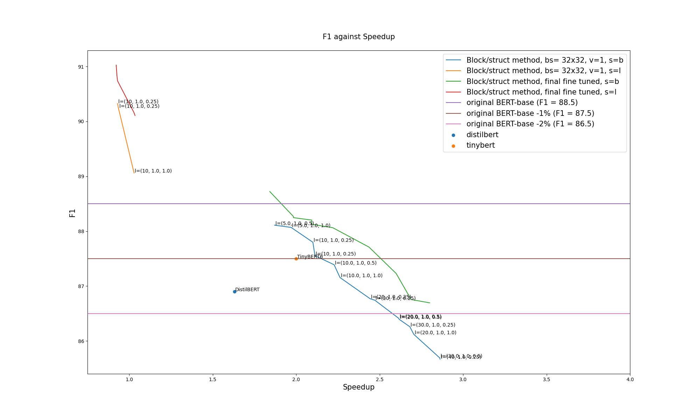

# Neural Networks Block Movement Pruning

**[Movement pruning](https://arxiv.org/abs/2005.07683)** has been proved as a **very efficient
method to prune networks in a unstructured manner**.
 
 [High levels of sparsity](https://github.com/huggingface/transformers/tree/master/examples/research_projects/movement-pruning) can be reached with a minimal of accuracy loss. 

The resulting sparse networks can be **compressed heavily**, saving a lot of permanent storage space on servers or devices, and bandwidth, an important advantage for edge devices.

**But efficient inference with unstructured sparsity is hard.**

Some degree of structure is necessary to use the intrinsic parallel nature of today hardware.

**Block Movement Pruning** work extends the original method and explore **semi-structured and structured variants** of Movement Pruning.

| Task                           | BERT base performance | BERT network |  Performance / Bert-base    | Speedup (compared to BERT-base)             | 
| :---:                          | :---:                    | :---: | :---:                | :---:                  | 
| SQuAD - Dev EM/F1           | 80.4/88.1                | large base base base | +2.5% 0% -1% -2%       | 1.0x 1.8x 2.25x 2.6x | 
| MNLI - Dev acc/MM acc       | 84.5/84.9                | |                   |  | 
| QQP - Dev acc/F1            | 91.4/88.4                | |                   |  | 

