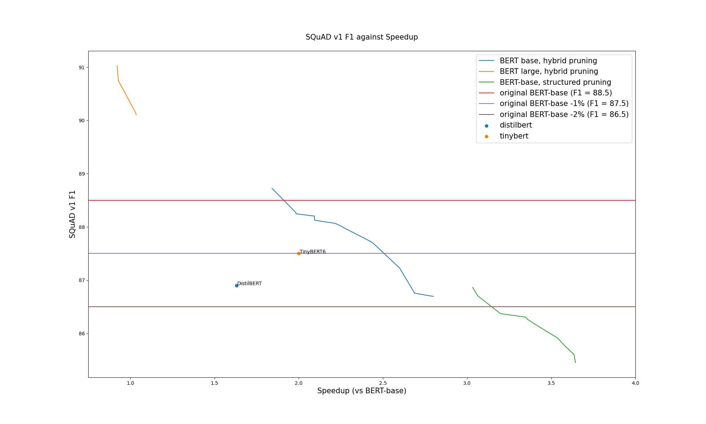

# Neural Networks Block Movement Pruning

**[Movement](https://arxiv.org/abs/2005.07683) [pruning](https://github.com/huggingface/transformers/tree/master/examples/research_projects/movement-pruning)** *has been proved as a **very efficient
method to prune networks in a unstructured manner**. High levels of sparsity can be reached with a minimal of accuracy loss. 
The resulting sparse networks can be **compressed heavily**,
saving a lot of permanent storage space on servers or devices, and bandwidth, an important advantage for edge devices.
**But efficient inference with unstructured sparsity is hard.**
Some degree of structure is necessary to use the intrinsic parallel nature of today hardware.
**Block Movement Pruning** work extends the original method and explore **semi-structured and structured variants** of Movement Pruning.*

##  
## Results

### Squad V1
The experiments were done first on SQuAD v1.

Two networks were tested: BERT-base, and BERT-large.

Very significant speedups where obtained with limited drop in accuracy.

Here is a selection of the networks that are obtained through the different variant method variants.

The original "large" and "base" finedtuned models were added in the table for comparison.

The "BERT version" column shows which base network was pruned.
The parameter count column is relative to linear layers, which contain most of the model parameters (with the embeddings being most of the remaining parameters).

**F1 difference, speedups and parameters counts are all relative to BERT-base to ease practical comparison.**

    
|                                        model                                         |  type   |   method   |Parameters count|Theoretical speedup|   F1    | F1 diff |Full pipeline speedup|
|--------------------------------------------------------------------------------------|---------|------------|----------------|-------------------|---------|---------|---------------------|
|**[#1](https://huggingface.co/bert-large-uncased-whole-word-masking-finetuned-squad)**|**large**|**unpruned**|**+166%**       |**0.37x**          |**93.15**|**+4.65**|**0.35x**            |
|#2                                                                                    |large    |hybrid      |-17%            |1.2x               |    91.03|+2.53    |0.92x                |
|#3                                                                                    |large    |hybrid      |-40%            |1.7x               |    90.16|+1.66    |1.03x                |
|#4                                                                                    |base     |hybrid      |-59%            |2.4x               |    88.72|+0.22    |1.84x                |
|**[#5](https://huggingface.co/csarron/bert-base-uncased-squad-v1)**                   |**base** |**unpruned**|**+0%**         |**1.0x**           |**88.5** |**+0.00**|**1.0x**             |
|#6                                                                                    |base     |hybrid      |-65%            |2.9x               |    88.25|-0.25    |1.98x                |
|#7                                                                                    |base     |hybrid      |-67%            |3.1x               |    87.71|-0.79    |2.44x                |
|#8                                                                                    |base     |hybrid      |-73%            |3.8x               |    87.23|-1.27    |2.60x                |
|#9                                                                                    |base     |hybrid      |-74%            |3.9x               |    86.69|-1.81    |2.80x                |
|#10                                                                                   |base     |structured  |-86%            |7.3x               |    85.52|-2.98    |3.64x                |

### Main takeaways
- network #2: pruned from BERT-large, it's significantly more accurate than BERT-base, but have a similar size and speed.
- network #3: pruned from BERT-large, it is finally 40% smaller but significantly better than a BERT-base, and still as fast.

That means that starting from a larger networks is beneficial on all metrics, even absolute size, something observed in the [Train Large, Then Compress](https://arxiv.org/abs/2002.11794) paper.
  
- network #4: we can shrink BERT-base by ~60%, speedup inference by 1.8x and still have a ***better*** network
- networks #N: we can select a **tradeoff between speed and accuracy**, depending on the final application.
- last network: pruned using a slightly different "structured pruning" method that gives faster networks but with a significant drop in F1.

**Additional remarks**
- The parameter reduction of the BERT-large networks are actually higher compared to the original network: 40% smaller than BERT-base means actually 77% smaller than BERT-large.
We kept here the comparison with BERT-base numbers as it's what matters on a practical point of view.
- The "theoretical speedup" is a speedup of linear layers (actual number of flops), something that seems to be equivalent to the measured speedup in some papers. 
The speedup here is measured on a 3090 RTX, using the HuggingFace transformers library, using Pytorch cuda timing features, and so is 100% in line with real-world speedup.

### Comparison with state of the art 
If we plot the F1 of the full set of pruned networks against the speedup, we can see that we outperform fine-tuned TinyBERT and Distilbert by a large amount: 

Even in terms of saved size, we get smaller networks for the same accuracy:

